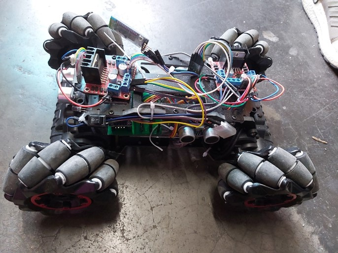
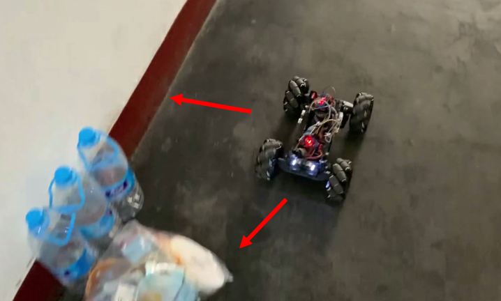
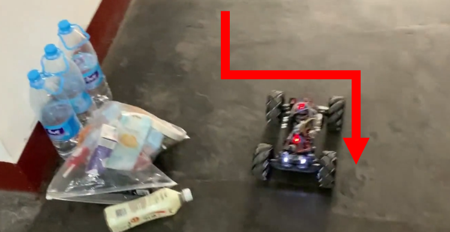

中文版，见[README_CN.md](./README_CN.md)
## Overview
We are four students from the School of Software Engineering, University of Electronic Science and Technology of China. This project is our one and a half year comprehensive course design project. The purpose is to design an ultrasonic automatic obstacle avoidance car.

<div align=center></div>

## Car hardware
- STM32C8T6 core board *1
- DC motor *4
- Mecanum wheel*4
- L298n motor drive board*2
- SR04 ultrasonic ranging module*3
- HC-05 Bluetooth*1 (optional, used to return the detected distance to the terminal)
- Hub board*1 (optional, hub for stable connection)
- LED light*2 (optional, looks cooler)
- Switch*1
- DuPont line several

## Car running system
- UCOS-II (bare board driver programming is also available for this project, we use the operating system to better understand the operating system structure)

## Development environment
- Keil uVision5
- Windows operating system (Keil only supports Windows)
- ST-link or other tools for burning.

## Directory Structure

Folder|Main Function
-|-
APP|obstacle avoidance task and system configuration
BSP|Board-level support package, mainly initialize GPIO and configure the clock (see the file for wiring)
HardWare|Drive of each hardware module
Libraries|STM32 required library files
uCOS-II|uCOS-II system source code

## Operation
<div align=center></div>
<center>Obstacles detected in front and right</center>

<div align=center></div>
<center>Avoid obstacles</center>

```
If you have any questions, please contact: jiuerrose@outlook.com