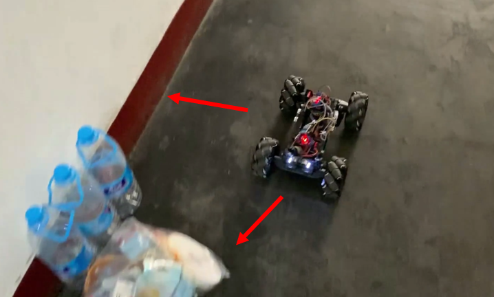

For English version, See [README.md](./README.md)
## 概况
我们是四名来自电子科技大学软件工程学院的学生。该项目是我们为期一年半的综合课程设计项目。目的是设计一个超声波自动避障小车。

<div align=center></div>

## 小车使用的硬件
- STM32C8T6核心板*1
- 直流电机*4
- 麦克纳姆轮*4
- L298n电机驱动板*2
- SR04超声波测距模块*3
- HC-05蓝牙*1 （可选，用于将检测到的距离返回到终端）
- 集线板*1 （可选，集线以使连接稳定）
- LED灯*2 （可选，显得更酷）
- 开关*1
- 杜邦线若干

## 小车运行系统
- UCOS-II （本项目亦可裸板驱动编程，我们使用操作系统以更好地了解操作系统结构）

## 开发环境
- Keil uVision5
- Windows 操作系统 （Keil仅支持Windows）
- ST-link或其他用于烧录的工具。

## 目录结构

文件夹|主要作用
-|-
APP|避障任务以及系统配置
BSP|板级支持包，主要初始化GPIO和配置时钟 （接线情况见该文件）
HardWare|各个硬件模块的驱动
Libraries|STM32所需库文件
uCOS-II|uCOS-II系统的源代码
> Note: 如果源码中有乱码，那是因为Keil的默认编码格式为GB2312，而一般编辑器默认为UTF-8。
## 运行情况
<div align=center></div>
<center>检测到前方和右方有障碍物</center>

<div align=center></div>
<center>避开障碍物</center>

``` 
有任何疑问，欢迎联系：jiuerrose@outlook.com